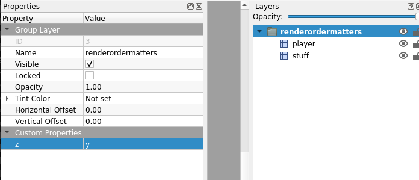

# sti-renderorder
Allow grouped layers to swap render order in [STI](https://github.com/karai17/Simple-Tiled-Implementation) a loader for maps made in [tiled](https://www.mapeditor.org/) for love2d.

This will allow you to have things in your amp that can be "behind" or "in front of" your character.

## usage

First, make a layer-group in your map that has the string custom-property `z` which can be either `x` or `y`:



Next, put sti-renderorder.lua in your project's path.

Next, load your map in STI, as you normally would, but with one extra step:

```lua
local sti = require "sti"
local sti_renderorder = require "sti-renderorder"

map = sti("maps/map01.lua")
sti_renderorder(map)
```

Now, everything should work the same, but all the layers in your group will decide which to render on top or on bottom, depending on the `z` property.