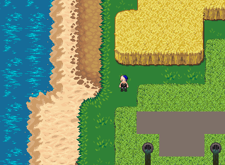
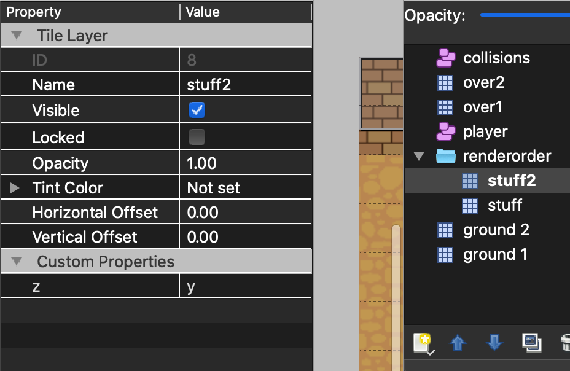

# WIP

I am still working on this

# sti-renderorder

Allow grouped layers to swap render-order in [STI](https://github.com/karai17/Simple-Tiled-Implementation) a loader for maps made in [tiled](https://www.mapeditor.org/) for love2d.

This will allow you to have things in your map that can be "behind" or "in front of" your character, as they move around. This is meant to fix this issue:





## usage

First, make a layers in your map that has the string custom-property `z` which can be either `x` or `y`:



Next, put sti-renderorder.lua in your project's path.

Next, load your map in STI, as you normally would, but with a couple extra steps:

```lua
local sti = require "sti"
local sti_renderorder = require "sti-renderorder"

map = sti("maps/map01.lua")

-- 2nd param is layers that should rendered over or under depending on position
sti_renderorder(map, {})

-- do this in draw or update, param is rect to compare, like "player" object that can move in front or behind things
map:renderorder({ x = 100, y = 100, height = 32, width = 32 })
```

Now, everything should work the same, but all the layers in your group will decide which to render on top or on bottom, depending on the `z` property.


I also made a demo-project in [demo/](demo/) that you can run with `love demo`.